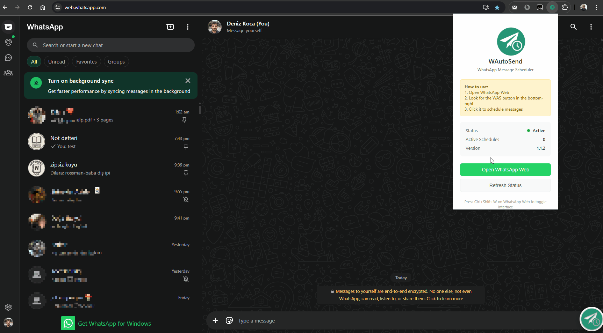

# WAutoSend

Local-only Chrome extension that schedules and sends messages in WhatsApp Web. No APIs. No servers. Just a clean in-page UI and a reliable "send at time" engine with privacy-focused post-send actions.

---

## Features  

<p align="center">
  
</p>


- Schedule multiple messages at specific times (24h format)
- Multi-contact support (comma-separated names) with auto chat-switching
- Message source: typed text or clipboard fallback
 
### **Privacy-First Post-Send Actions**
- **Auto-refresh page** (default) - Avoids read confirmations by refreshing WhatsApp Web
- **Auto-close tab** - Maximum privacy: avoids read confirmations AND online status
- **Do nothing** - Stay in current chat (original behavior)

---

## Why I Built It

I often remembered messages hours early, then forgot to send them. So I needed it.  
And because everything else either required WhatsApp Business, signing up for some shady API key, or just didn’t work.  
So I built a dumb, brute-force solution that just... works. Locally and mostly reliably. 

### What WAutoSend is *Not*

WAutoSend is not a spam tool.  
It does not:

- Send messages to multiple contacts or groups
- Harvest phone numbers or chat lists
- Use any private WhatsApp APIs
- Let you run marketing campaigns

**You must open the chat manually.**  
**It only sends one message to that chat, at the time you schedule.**

If you're looking for a bulk sender or spam blaster, this is not it.  
It’s a small automation helper for personal use only.

---

## Install (Unpacked)

This is not in the Chrome Web Store. Load it locally:

1) Clone the repo

```bash
git clone https://github.com/BDenizKoca/WAutoSend---Message-Scheduler.git
cd WAutoSend---Message-Scheduler
```

2) In Chrome go to chrome://extensions
- Enable Developer mode
- Click "Load unpacked" and select the cloned folder

3) Open https://web.whatsapp.com and log in

4) Use the floating FAB

---

##  Usage

### Basic Setup
1) Open WhatsApp Web and bring up the panel (FAB or Ctrl+Shift+W)
2) Add a schedule:
   - **Time** (24h format, e.g., 14:30)
   - **Message text** or check "Use clipboard if empty"
   - **Contacts** (optional, comma-separated; if empty, sends to current chat)
3) **Choose post-send action:**
   - **Auto-refresh** (default) - Refreshes page to avoid read confirmations
   - **Auto-close tab** - Closes tab to avoid read confirmations + online status
   - **Do nothing** - Stay in current chat
4) Click **"Test Send"** to validate functionality
5) Keep the tab open; the extension will send at scheduled time(s)

###  Advanced Tips
- **Contact Names**: Use exact names as they appear in your WhatsApp
- **Similar Names**: Add qualifiers (e.g., "John Smith" vs "John S.")
- **Groups**: Use the exact group name as it appears in your chat list
- **Privacy**: Use "Auto-close tab" for maximum privacy (no read confirmations + appears offline)
- **Testing**: Always use "Test Send" first to verify everything works

---

##  **Tech Stack**
- **scheduler.js**: Message timing, injection, sending, and post-send actions
- **ui.js**: Interactive panel with radio buttons and real-time status
- **storage.js**: Persistent settings and schedule management
- **styles.css**: Modern, responsive UI with privacy-focused design
- **debug.js**: Comprehensive testing and diagnostic tools

---

## Future Plans

I have really wanted add attachment support somehow, however sadly seems like it is not possible. So feature-complete but open to contributions.

---

## 📄 License

**MIT License** - You can use, modify, and distribute freely with attribution.
